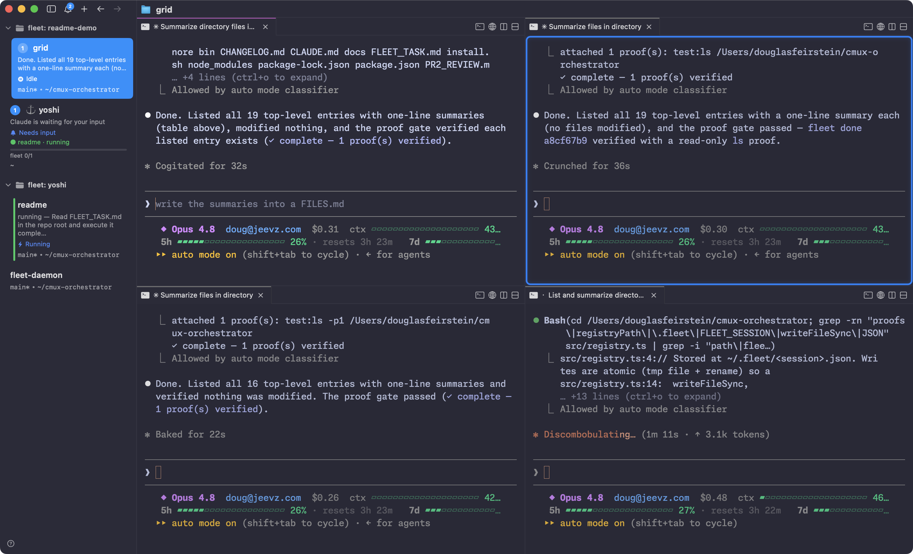

# Fleet

A multi-agent orchestrator for [cmux](https://github.com/manaflow-ai/cmux). One
Claude Code session becomes the **⚓ Fleet Captain** that launches, steers, and
monitors a fleet of **worker** Claude Code sessions — each in its own cmux pane,
all running under your **Max plan** ($0 per token, no API key).

It's the [pi-style multi-agent rig from the cmux demo](https://youtu.be/8jDXI4_rJOE),
rebuilt as a thin CLI you drive from any project in plain language.



---

## Zero to Captain — 4 steps

You don't wire anything up by hand. You install one terminal, launch Claude, and
ask it — in plain English — to set up the rest.

### 1. Install cmux

cmux is the GPU-accelerated terminal Fleet runs on. Download the macOS app from
**[cmux.com](https://cmux.com)** (source: [manaflow-ai/cmux](https://github.com/manaflow-ai/cmux)).

### 2. Open cmux and type `claude`

Claude Code launches right inside a cmux terminal. Log in with your **Pro / Max /
Team** subscription — every worker the Captain spawns inherits that session, so
it's **$0 per token, no API key**.

### 3. Tell Claude:

> **“clone fleet and launch my captain.”**

### 4. That's it.

Claude clones Fleet, installs it, runs a health check, and hands you a badged
**⚓ Captain** workspace. From there you talk to the Captain in plain language and
it runs the fleet for you.

---

### What that one sentence resolves to

“clone fleet and launch my captain” is all you say — Claude runs the block below
and drops you into a Captain session. It's also a copy-paste path if you'd rather
do it yourself:

```bash
git clone https://github.com/dfeirstein/fleet.git
cd fleet && ./install.sh        # checks cmux/Node/git, npm install (no build), links `fleet` + the skill
fleet doctor                    # confirm green
fleet captain                   # launches "⚓ <YourName>" — your Fleet Captain workspace
```

`install.sh` checks for cmux/Node/git, installs deps (no build step — TS runs via
`tsx`), symlinks `fleet` into `~/.local/bin`, and installs the Fleet skill into
`~/.claude/skills`. If `~/.local/bin` isn't on your PATH, add it
(`export PATH="$HOME/.local/bin:$PATH"`) and reopen your shell.

- **`fleet doctor`** — diagnose an install (cmux reachable? PATH? skill? daemon?).
- **`fleet setup`** — re-link after a `git pull` (idempotent).
- **`fleet setup --hotkey`** — also bind **⌘⇧Y** in your `cmux.json` to spawn a
  sibling Captain (`fleet captain --split`) in a split pane of the focused
  workspace. Merges JSONC-safely (backs up first, preserves your other keys, idempotent)
  then `cmux reload-config`. cmux asks to trust the command on first press; change the
  key by editing `actions.fleet.spawnCaptain.shortcut`.


`fleet captain [name]` (alias of `fleet orchestrate`) appoints the control plane.
`fleet` runs from any directory; each Captain gets its own isolated fleet session,
and workers can be dispatched into any project.

---

## At a glance

```
You ⇄ Claude Code (Fleet Captain)        ← your Max session
        │  loads the `fleet` skill
        ▼
      fleet spawn / grid / read / send / watch / status / kill
        │  (wraps the cmux CLI + Unix socket)
        ▼
      cmux ⇄ worker Claude Code sessions  ← same Max session, isolated workspaces
        ▲                              │
        └── notification feed ─────────┘  (deterministic "turn done" signal)
                  ▲
      fleet daemon (always-on heartbeat) ── escalates to you when something needs attention
```

## Why

cmux is a scriptable, GPU-accelerated terminal (workspaces → panes → surfaces)
with a JSON-RPC socket — but it is *not* an orchestrator. `fleet` is the
control layer: it turns the verbs cmux exposes (`new-workspace`, `new-split`,
`send`, `read-screen`, `notification.list`, …) into a small, stable command set
an orchestrating Claude can reason over, plus a persistent registry of who's
doing what.

## Requirements

- macOS with the **cmux app** running (`cmux` CLI on `PATH`)
- **Node 20+** (uses `tsx`, no build step)
- **Claude Code** logged into a Pro/Max/Team subscription (workers inherit it)

## Quickstart (CLI verbs)

Inside a Captain session you just say what you want — the `fleet` skill teaches
Claude the loop. Or drive the CLI directly:

```bash
fleet spawn --label api "build the REST API in src/api"   # autonomous, classifier-guarded
fleet status                                              # live fleet table
fleet watch                                               # block until the fleet is idle
fleet read api                                            # peek at a worker's screen
fleet send api "use zod for request validation"           # steer it mid-flight
fleet grid 2x2                                            # video-style swarm: 4 panes, 1 workspace
fleet kill --all                                          # tear everything down
```


## Commands

| Command | Purpose |
| --- | --- |
| `fleet captain [name]` | Appoint a Fleet Captain — a badged control-plane workspace you talk to (alias of `orchestrate`; `--resume` keeps her context) |
| `fleet spawn <task>` | Launch a worker in its own workspace on a task |
| `fleet grid <C>x<R> [task]` | Tile one workspace into a grid of worker panes (shared FS) |
| `fleet status` | Snapshot the fleet (state per agent) |
| `fleet watch` | Block until the fleet is idle; prints transitions + sidebar dashboard |
| `fleet read <agent>` | Capture a worker's terminal screen |
| `fleet send <agent> <text>` | Type into a worker (steer it) |
| `fleet verify <agent> [--check <cmd>]` | Independent eval gate (judge ≠ generator); `--visual <url>` is browser-backed |
| `fleet done <agent> --proof <kind:ref>` | Attach proof-of-work and run the gate (fails closed; see below) |
| `fleet review <agent>` | Open review panels for a worker (visual diff + latest wave report) |
| `fleet prompts` / `fleet reply <agent> <ans>` | List + answer a worker's pending Feed prompts over RPC (no keystrokes) |
| `fleet digest` | Capture live workers' output to disk and return per-wave digests |
| `fleet objective <goal> --done\|--verify <c>` | Loop a worker until a stop condition passes |
| `fleet kill <agent\|--all>` | Stop a worker and clean up its pane/workspace |
| `fleet resume [--apply]` | Reconcile the registry against live cmux (prune dead, refresh refs; restore after a cmux restart) |
| `fleet daemon <start\|stop\|status>` | Always-on heartbeat supervisor |
| `fleet notify-orchestrator <msg> [--urgent]` | Push a message to the Captain |

Agents are matched by id, id-prefix, or label. Run `fleet help` for the full
surface — durable memory (`bootstrap`, `currency`, `audit-docs`, `state`, `recall`,
`profile`, `outcomes`), captured skills (`capture`, `skill-audit`, `reflect`), and
`log`, `browser-state`, `setup`, `doctor`.

## Permission modes

Workers map onto Claude Code's permission modes:

- **`auto`** (default) — autonomous, but Claude Code's classifier blocks
  dangerous actions (deploys, `curl | bash`, force-push, mass deletes, secret
  exfil). The right default for almost everything.
- **`--gated`** — prompts on every risky action; for sensitive work.
- **`--yolo`** — `--dangerously-skip-permissions`, no checks. Sandboxes only.

Cost is **plan quota, not dollars** — N parallel Opus workers draw on your
shared 5-hour/weekly Max limits, so keep concurrency modest.

## How a worker's "done" is detected

cmux's wrapped Claude Code emits a notification when a worker's turn ends
(`Completed in <dir>` / `Waiting`), keyed to its `workspace_id`. `fleet` reads
that feed (`notification.list`) for a **deterministic** idle signal, with a
screen-text heuristic as fallback and `lastDispatchAt` guarding against
stale notifications from a previous turn.

**Idle ≠ done.** Turning in work runs through the **proof-of-work gate**
(`fleet done <agent> --proof test:<cmd>|file:<path>`): the proof is checked by an
*independent* path (judge ≠ generator) and the gate **fails closed** — no proof, a
failed check, or a metadata-only `note:` never counts as complete. A pass emits a
`done-<agentId>` cmux signal you can block on.

## The daemon

`fleet daemon start` runs a token-free heartbeat in its own cmux pane (modeled
on the openclaw / Hermes gateway). Each beat it reconciles the fleet, refreshes
the sidebar, auto-clears stuck `--yolo` bypass dialogs, and **escalates anything
that needs you** — `awaiting-input`, stuck/zombie, error, or rate-limited:

- **urgent** + Captain idle → injected as a new turn in your pane
- otherwise → appended to `~/.fleet/daemon/inbox.md` (check it at turn start)

It's also **proactive** (gated, not spammy): a live `💓 fleet` heartbeat line on
the sidebar, and a single wake-prompt offering the next step when a wave of
workers finishes (`--no-proactive` to disable).

Scheduling is left to Claude Code's `/schedule`; a scheduled routine does its
work with `fleet …` and calls `fleet notify-orchestrator` to report back through
the same channel.

## Architecture

```
src/
  cli.ts            # arg parsing → command dispatch
  cmux.ts           # typed wrapper over the cmux CLI/socket (the only place we shell out)
  registry.ts       # ~/.fleet/<session>.json — who's doing what (per project)
  status.ts         # screen-heuristic classifier (running/idle/awaiting/…)
  notifications.ts  # cmux notification feed → deterministic turn-end signal
  events.ts         # event reactor: classifies the cmux event stream into worker-state signals
  proof.ts          # the proof-of-work gate (judge ≠ generator, fails closed)
  project-memory.ts # durable-memory paths (CLAUDE.md + .claude-docs, outcome log)
  dashboard.ts      # mirror fleet state to the cmux sidebar (set-status/progress)
  commands/         # spawn, grid, read, send, status, watch, kill, resume, daemon, notify,
                    #   done, verify, review, digest, recall, capture, bootstrap, currency, …
  daemon/           # config, inbox, channel, policy, loop (the heartbeat supervisor)
skills/fleet/SKILL.md   # teaches an orchestrating Claude the spawn→monitor→steer loop
```

A worker that ships into a project also leaves it stronger: the **project-memory**
subsystem (`fleet bootstrap` / `currency` / `audit-docs`) keeps each repo's
`CLAUDE.md` + `.claude-docs/` durable and current, and an outcome log (`fleet
outcomes` / `recall`) records what was delegated and how it went.

**Addressing note (hard-won):** workers are addressed by `--workspace <uuid>
--surface <uuid>` together. `--workspace` alone resolves to the focused pane's
selected surface, which breaks once a workspace also holds a browser surface
("Surface is not a terminal"); `--surface` alone is unreliable. UUIDs are used
throughout because `workspace:N`/`surface:N` refs renumber as workspaces churn.

## Development

```bash
npm run typecheck          # tsc --noEmit
./bin/fleet <command>      # run via tsx, no build step
```

Built in phases (`git log`): 0–1 core loop · 2 monitoring + reliability ·
3 deterministic completion · 4 grid swarm · 5 resume + daemon · 6 proof-of-work
gate · 7 event-driven reactor · 8 browser rail · 9 mission-control + restart-proof
fleets · 10 RPC steering.

## Contributing

Issues and PRs welcome. The bar: surgical scope, a CHANGELOG entry under
**Unreleased**, and verification evidence (commands + results) in the PR body —
open for review, don't self-merge. Operational-review issues follow the format of
[#30](https://github.com/dfeirstein/fleet/issues/30). Security problems go to the
maintainer privately, not a public issue. Full process in
**[CONTRIBUTING.md](CONTRIBUTING.md)**.
